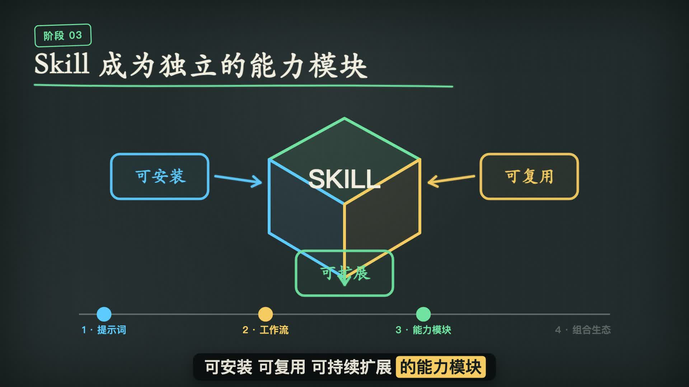

# HT Chalkboard Video

使用 **Fish Audio + Remotion** 制作中文粉笔黑板风格的知识讲解视频。

它复用 `chalkboard-video` 的手绘视觉、逐词字幕、动画和轻量音效规范，
但将旁白统一替换为 Fish Audio。默认音色是适合 AI 知识讲解的
**短视频知识男声**。

## 示例

[](./assets/skill-history-demo.mp4)

点击预览图播放，或[直接下载 MP4](./assets/skill-history-demo.mp4)。

- 画面：1920×1080、30 FPS、粉笔黑板动画
- 配音：Fish Audio `s2.1-pro-free`
- 音色：短视频知识男声
- 同步方式：根据新旁白逐词时间戳重新剪辑画面
- 声音处理：不变速、不拉伸、不移调

## 安装

将仓库克隆到 Codex Skills 目录：

```bash
git clone https://github.com/hongtao520/ht-chalkboard-video.git \
  ~/.codex/skills/ht-chalkboard-video
cd ~/.codex/skills/ht-chalkboard-video
```

本机需要：

- Python 3.9+
- `ffmpeg`
- Remotion 项目环境
- 已安装的 `chalkboard-video` Skill

## 配置 Fish Audio

登录 [Fish Audio API 密钥页面](https://fish.audio/zh-CN/app/api-keys/)，
创建一个 API Key。

不要把密钥粘贴进聊天、项目源码或 GitHub。运行隐藏输入配置器：

```bash
python3 scripts/configure_fish.py
```

密钥会保存在 Skill 根目录的 `.env`，文件权限设置为 `0600`，并被
`.gitignore` 排除。检查配置时不会显示密钥：

```bash
python3 scripts/configure_fish.py --check
```

也可以仅在当前终端提供：

```bash
export FISH_API_KEY="your-key"
```

## 默认音频配置

音频配置沿用 Vox Agent 的 Fish Audio 参数结构：

```json
{
  "provider": "fish",
  "model": "s2.1-pro-free",
  "name": "短视频知识男声",
  "reference_id": "4e6384a9da6c4d7088e85ea163d6d1de",
  "speed": 1.0,
  "temperature": 0.65,
  "top_p": 0.7,
  "trim_silence": true
}
```

其中 `trim_silence` 只裁剪文件首尾静音，不删除句子内部的自然停顿。
Fish Audio 原始 WAV 为 44.1 kHz，交付音频会转换为 48 kHz，但不会改变
语速或音高。

## 生成旁白

准备 UTF-8 文案文件：

```bash
python3 scripts/fish_narrate.py \
  --text-file narration.txt \
  --output public/audio/narration.wav
```

也可以直接传入短文本：

```bash
python3 scripts/fish_narrate.py \
  --text "Skill 正在成为智能体可以安装和复用的能力模块。" \
  --output public/audio/narration.mp3
```

## 音画同步原则

1. 先生成完整 Fish Audio 旁白。
2. 转录这条实际生成的音频，取得逐词时间戳。
3. 按语义把旁白切分为每段 6–15 秒的动画板块。
4. 让场景切点、绘制动画、字幕和音效跟随实际词语出现时间。
5. 新音色时长不同，就剪辑画面和修改视频总时长。

禁止使用：

- `atempo`
- `playbackRate`
- 音频时间拉伸
- 变调
- 为匹配旧视频而强制目标时长

原则是：**画面跟着声音走，不让声音迁就旧画面。**

## Skill 使用方式

安装后可以直接提出：

```text
使用 ht-chalkboard-video，制作一个中文的 AI Agent 发展历程动画视频。
使用 Fish Audio 默认男声，保持原始语速，让字幕和画面跟随旁白同步。
```

Codex 会读取 [SKILL.md](./SKILL.md)，继承 `chalkboard-video` 的视觉制作
规则，并使用本仓库的 Fish Audio 配音配置。

## 安全说明

- 仓库不包含任何真实 API Key。
- `.env` 已被 Git 忽略。
- 示例文件 `.env.example` 只包含空变量。
- 如果密钥曾经出现在公开仓库，应立即到 Fish Audio 后台撤销并重新生成。
